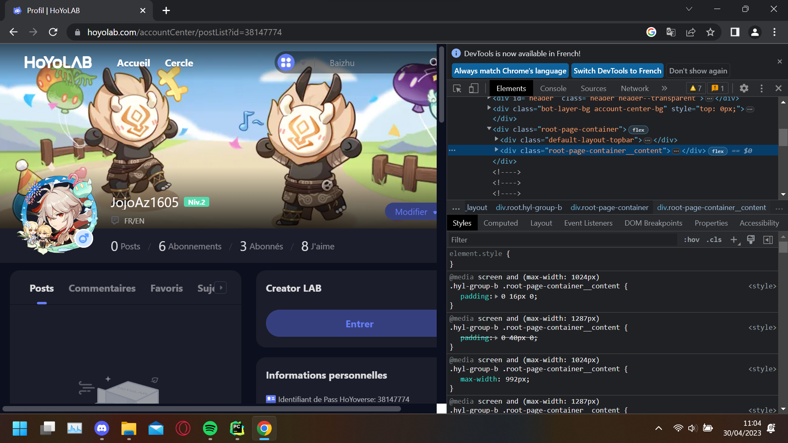
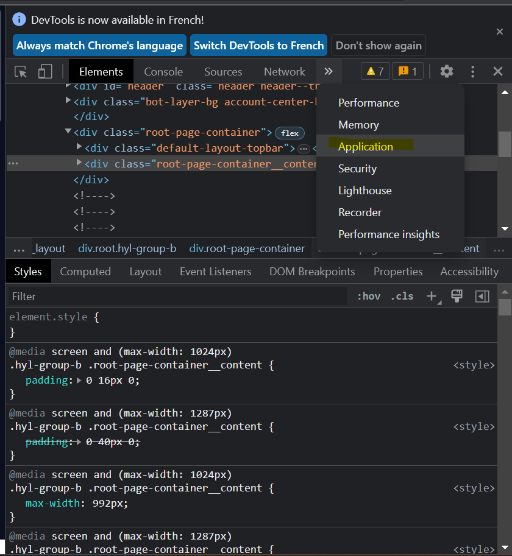
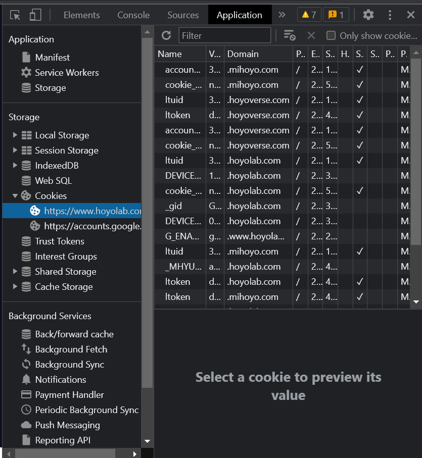

# Guide d'utilisation
1. Connectez-vous à Hoyolab sur votre navigateur favori.
2. Utilisez la fonction <code>inspecter l'élément</code> de votre navigateur. 

3. Allez dans l'onglet <code>Application</code>

4. Sous <code>Storage</code> > <code>Cookies</code> > <code>https://www.hoyolab.com</code>

5. De là, cherchez deux clés: <code>ltuid</code> et <code>ltoken</code> et copiez les valeurs quelque part.
6. Ouvrez le dossier où est situé le <code>main.exe</code>, et cherchez un fichier nommé <code>.env</code>.
7. Complétez les valeurs de <code>ltuid</code> et <code>ltoken</code> et sauvegardez le <code>.env</code>.
8. Plus qu'à lancer le <code>main.exe</code>!
